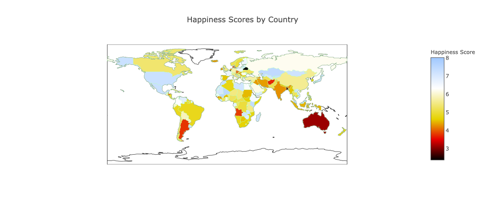
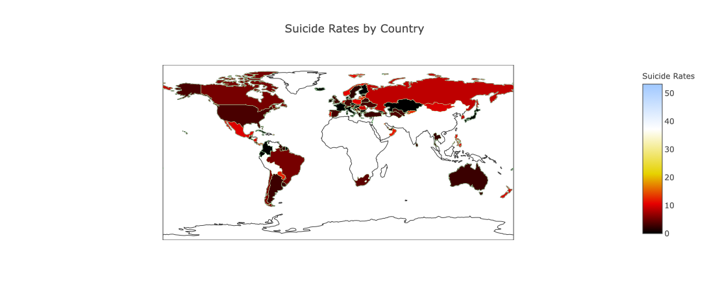
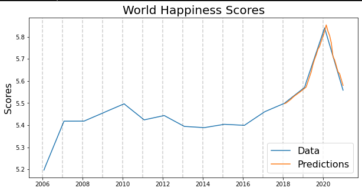

# World_Development_Mental_Health_Acquisition

## Preview Deployment
https://share.streamlit.io/281clo/world_development_mental_health_acquisition/main/deploy.py

## Overview

The goal is to find contributing factors to mental health worldwide and make predictions on these features to see where the World Health Organization can divert resources to assist in the mental health of people worldwide. This project will primarily be focusing on North and South America as there are many countries with the contributing factors varying in complexity across different cultures so utilizing a more focused approach will produce more accurate results to the countries in question. The data comes from multiple sources. Methods include combining datasets, preprocessing, testing significant features and predictive modeling. Results show some the significant features that affect suicide rates are multilateral debt, access to clean water and electricity, education and freedom to make life choices. Recommendations would vary from country to country but overall recommendation is Universal Mental Health care, better adequacy of social safety net programs to those experiencing hardship.




## Business Problem

Finding the contributing factors to suicide rates by country using, happiness scores, world development indicators and suicide rates from three different datasets. There is a vast amount of data contained in these datasets so the challenge is going to be narrowing down which features to work with. We can then use these feature to build a predictive model to tell us what direction a country is heading in terms fo mental health. This would be really useful to the World Health Organization as they could use these models to facilitate help to those in need in different countries.


## Data Understanding

Multiple sources of data, the first being from the World Bank containing over a thousand indicators of economic development worldwide. The second comes from the Gallup World Poll containing the World Happiness Report and is a survey of the state of global happiness. The last is a dataset contains the suicide rates by country referenced from United Nations Development Program, World Health Organization, and the World Bank. The two target variables are 'Life Ladder' (happiness score) from the World Happiness Report and 'suicides/100k pop' from the Suicide Rates dataset. The world development dataset is only being used as a reference to find contributing features to either suicide rates or happiness scores and contains over a thousand indicators by year. 

## Methods

After cleaning, preprocessing, and combining our data, we start with a F_regressor to find the F-statistic and P-values of all our features compared to our target to find which features are most significant for our model. We then utilize SVR, RandomForestRegressor, and time series to build an inferential model and a predictive model.



### Results


With our time series model we have a prediction of lower happiness scores worldwide as well as social support as a whole. Our previous models tell us the most significant feature is social support because it is significant in relation to both suicide rates and happiness scores worldwide.  Our best inferential models came out to a r2 score of around .79 and .88 respectively meaning that between our two models 79% and 88% of the variation in suicide rates and happiness scores can be determined by our features. The most significant features in our data were, freedom to make life choices, education, social support, generosity, and fixed broadband services. With these features we were able to determine the fluctuation in happiness scores and suicide rates with fairly well accuracy. It is wise to take note that there is no 'one fits all' in this situation. While some countries were impacted by economic factors such as inflation or lack of income such as Russia, other countries with the highest impacts related to social or cultural factors such as Japan. The World Health Organization can use the model to determine mental health factors in a certain country and possibly take action accordantly.




## Conclusions


To conclude we can see that every country is different and suicide and mental health can be very complex but with predictive modeling we can use different features to see if certain country is predicted to have a increase in suicides and act accordantly. Recommendations would include Universal Mental Health care for individuals experiencing hardship. More recommendations would vary by country but making it a priority to have access electricity and basic water needs should be focused on. Last is social safety net programs for those experiencing hardship such as health care programs, employment security programs, and child care assistance. One very big topic our analysis did not touch on is substance abuse and the affect it has on mental health. For future research this would be the first thing to include as it has a great impact on mental health and possibly suicides. The complexity of the subject and missing a significant factor in mental health means that our analysis does not fully solve the problem but definitely a step in the right direction. 
***

## For More Information

Please review my full analysis in [Modeling Notebook](./Modeling.ipynb) or my [presentation](./World_Indicators.pdf).

For any additional questions, please contact Carlos McCrum. 


## Repository Structure

├── Code                                <- Folder containing preparation of data
├── Data                                <- Folder containing all datasets 
├── Images                              <- Folder containing images used in the notebook 
├── Modeling.ipynb                      <- Final notebook
├── Data_Preprocessing.ipynb            <- Preprocessing, cleaning notebook
├── README.md                           <- The file you're currently reading from
├── deploy.py                           <- Deployment         
├── requirements.txt                    <- Requirments for deployment
├── World_Indicators.pdf                <- PDF version of project presentatio
```

